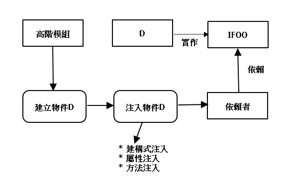

Dependency Injection 相依性注入
===
[參考](https://www.huanlintalk.com/2011/11/dependency-injection-5.html)

# 注入方式
* 建構式注入(Constructor Injection)
* 屬性注入(Property Injection)
* 方法注入(Method Injection)



## 建構式注入
一般的注入首選，透過類別的建構式，讓外界傳入符合介面的物件，類別內要有個私有成員，變數型態為介面型態，另外會將該私有成員加上readonly關鍵字，相依物件一旦在建構式設定完成後，不能再改變。

```csharp
class AuthenticationService
{
    private readonly IMessageService msgService;

    public AuthenticationService(IMessageService service)
    {
        if (service == null)
        {
            throw new ArgumentException("service");
        }
        this.msgService = service;
    }
}
```

## 屬性注入
透過屬性來注入相依物件，跟建構式注入相似，類別內需要有變數來保存相依物件，主要跟建構式注入的差異，屬性注入來的比建構式注入晚，且外界不一定會設定該屬性
所以採用屬性注入時候，類別本身就要能夠取得相依物件的實做，如此一來，就算外界沒有注入相依物件，類別仍有預設的相依物件可用

```csharp
class AuthenticationService
{
    private IMessageService msgService;

    public IMessageService MessageService
    {
        get { return this.msgService; }
        set { this.msgService = value; }
    }

    public void Login(string userId, string password)
    {
        MessageService.Send(...);  // 使用相依物件。
    }
}
```
使用屬性注入的私有成員不可以宣告為readonly，因為屬性注入允許外界任何時候注入物件。
```csharp
private IMessageService msgService;
public IMessageService MessageService
{
    get
    {
        if (this.msgService == null)
        {
            this.msgService = new DefaultMessageService();
        }
        return this.msgService;
    }
    set { this.msgService = value; }
}
```


## 方法注入
「方法注入」（Method Injection）指的是用戶端每次呼叫某物件的方法時都必須透過方法的引數來傳入相依物件。此注入方式的適用時機如下：
提供服務的類別不需要在整個類別中使用特定相依物件，而只有在用戶端呼叫某些方法時才需要傳入那些物件。
用戶端每次呼叫特定方法時可能會傳入不同的物件，而這些物件唯一相同之處是它們都實作了同一個介面（或繼承自同一個抽象類別）。

已知的應用範例
ADO.NET 的 DbDataAdapter.Fill 方法有提供「方法注入」的機制，其函式原型如下：
protected virtual int Fill(
    DataTable dataTable,     // 查詢結果會填入此物件。
    IDbCommand command,      // 提供查詢命令的物件。
    CommandBehavior behavior // 細部控制命令的行為。
)

範例
仍以先前的 AuthenticateService 為例，如果 Login 方法允許外界指定使用何種驗證碼發送機制，便可改成這樣：
```csharp
public void Login(string userId, string password, IMessageService service)
{
    if (service == null)
    {
        throw new ArgumentException("service");
    }       
    service.Send(...);
}
```
