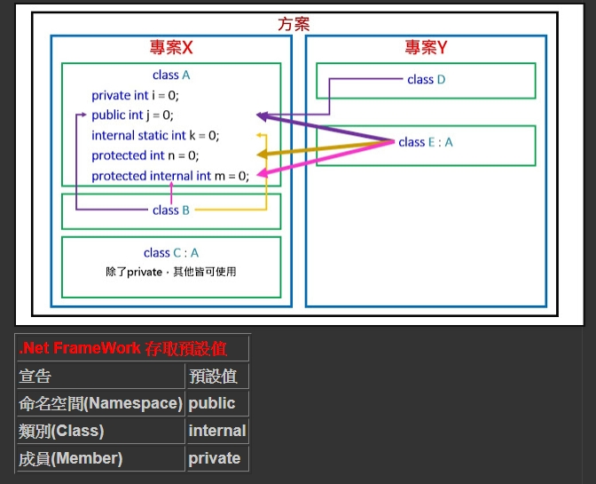

存取修飾詞
===
.net 的存取修飾詞主要有4種，分別是public、private、internal與private。
但可組合組六種的存取限制，如下:

public:未有存取限制。
private:只有類別本身可以存取。
internal:類別本身或同一組件內可存取。
protected:類別本身或繼承自該類別的衍伸類別可存取。繼承關係不限定一定要在同一個命名空間或組件。也就是只要有繼承關係即可。
protected internal:類別本身或繼承自該類別的衍伸類別或同一組件可存取。繼承關係不限定一定要在同一個命名空間或組件。也就是只要有繼承關係即可。
private protected:類別本身或同一組件且繼承該類別的的衍伸類別可存取。

